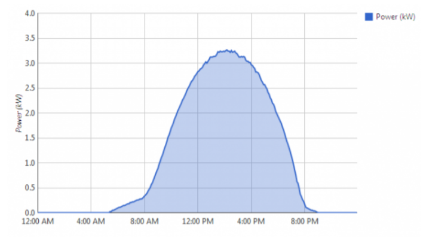
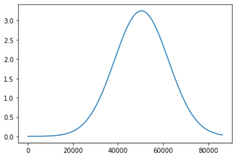

# PhotoVoltaic(PV) Simulator with RabbitMQ and Python

### By Brian Smith-Eitches

# Quick Start

## Setup

- Download [Docker](https://docs.docker.com/install/) on your host machine
- Install Python 3
- Clone this repository
- Activate Virtual Environment (if necessary), then run `pip install -r requirements.txt` from base directory of this repository

## Run

Open 3 terminal windows

- Terminal 1: run `sudo docker run -it --rm --name rabbitmq -p 5672:5672 -p 15672:15672 rabbitmq:3-management`
- Terminal 2: run `python simulator/receive.py`
- Terminal 3: run `python meter/main.py`

## Done

Check out the deeper dive to see implementation overview and optional arguments to pass to _simulator/main.py_. You may now shutdown the Docker container in Terminal 1.

# A Deeper Dive

## Intro

PhotoVoltaic (PV) power values (measured in kW) vary throughout the day. A real power profile we are trying to replicate can be seen below.

When evaluating the power value as a function of the time of day, it seems to be shaped similarly to a normal distribution or a bell curve. I chose to use a Jupyter Notebook to plot my simulated PV values as a function of the time of day (in seconds). Below is a plot of my simulated PV values.

I spot checked a couple of hour marks to recalibrate parameters to best simulate the true distribution. It is no easy feat to get a high level of accuracy on this portion of the assignment, so I deemed the current state of the notebook as sufficiently simulating PV Values throughout the day.

## Implementation details

### Overview

RabbitMQ is a Message Broker software that assists in transmitting messages from different applications/devices. In this use case, our sender is the meter which simulates home power consumption (reading 0-9000 Watts at each reading) and sends this meter value along with a timestamp to the _simulator/receive.py_ program via RabbitMQ's `meter` queue.

In _/simulator/receive.py_ following receipt of the reading, it will calculate the simulated PV power value from the curve above at the time of the day when the meter reading was recorded, then output the `timestamp`,`meter value (Watts)`, `simulated PV value (kW)`, and `sum of power values (Watts)`. After the last simulated home meter reading in the simulation is sent and consumed by _simulator/receive.py_, all the data will be output to _simulator/data.txt_

### Meter Configuration Options

By default, simply running `python meter/main.py` will work with default values for some configurable options. Below is a table of optional arguments along with examples of how to use them

<table>
<tr>
<th>Key</th>
<th>Format</th>
<th>Description</th>
<th>Default Value</th>
</tr>

<tr>
<td>beg</td>
<td>HH:MM:SS</td>
<td>The time of day in which the meter will begin  sending its simulated 0-9000 Watt values</td>
<td>12:00:00</td>
</tr>

<tr>
<td>end</td>
<td>HH:MM:SS</td>
<td>The time of day in which the meter will stop  sending its simulated 0-9000 Watt values</td>
<td>N/A</td>
</tr>

<tr>
<td>int</td>
<td>integer</td>
<td>The interval in seconds between two meter readings.  A value of 1 will send a meter reading each second.   A value of 60 will send a meter reading each minute.  A value of 3600 will send a meter reading each hour.</td>
<td>5</td>
</tr>

<tr>
<td>num</td>
<td>integer</td>
<td>The number of meter measurements desired in the simulation.  This value is not relevant if 'end' value is given </td>
<td>10</td>
</tr>
</table>

### Examples

1. Run `sudo docker run -it --rm --name rabbitmq -p 5672:5672 -p 15672:15672 rabbitmq:3-management` in Terminal 1
2. Run `python simulator/receive.py` in Terminal 2
3. Run any of the following in Terminal 3:

- `python meter/main.py beg=08:00:00`

  - Start at 8 am and measure default 10 readings every 5 seconds

- `python meter/main.py beg=09:00:00 end=10:00:00 int=30`

  - Start at 9 am, end at 10 am, and measure readings every 30 seconds

- `python meter/main.py beg=10:00:00 int=30`

  - Start at 10 am and have a default 10 readings every 30 seconds

- `python meter/main.py beg=11:00:00 num=100`
  - Start at 11 am and have 100 readings every default 5 seconds
